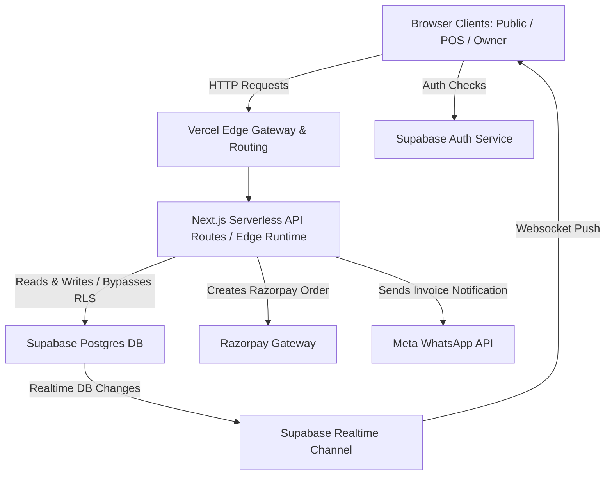
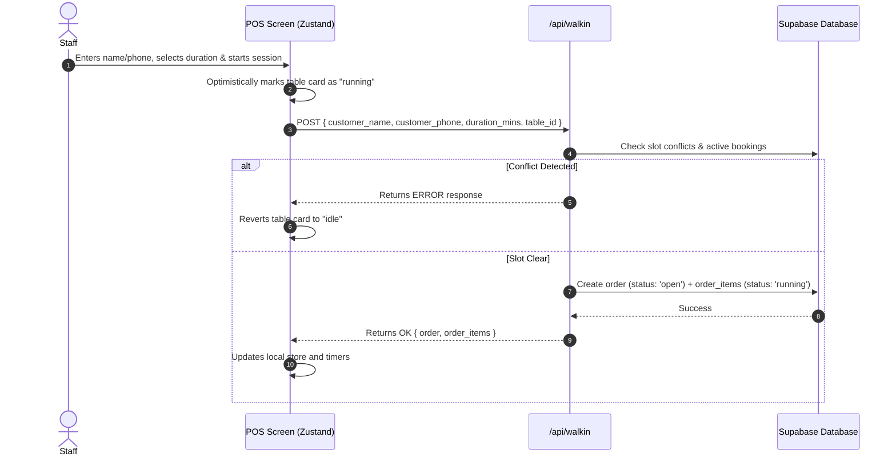
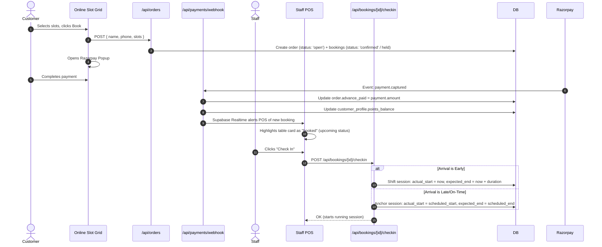
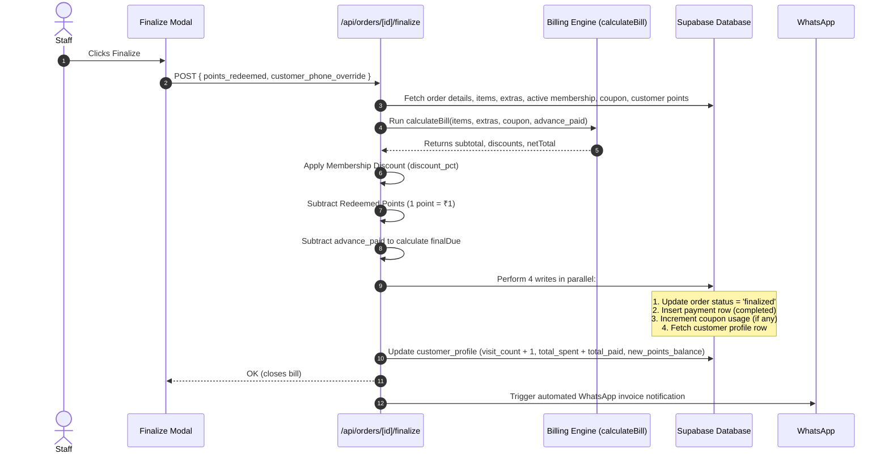
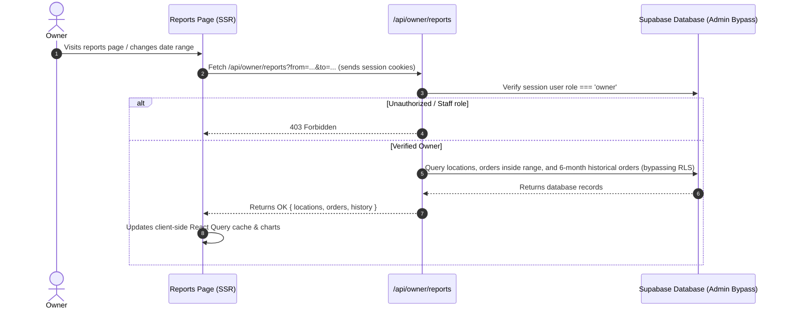
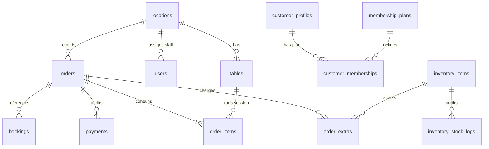

# Gamehaus — System Architecture & Technical Reference

This document serves as the authoritative technical reference for the Gamehaus project. It outlines the complete system design, database architecture, network data flows, state management, and external integrations.

---

## 1. High-Level Architecture Overview

Gamehaus uses a modern serverless model optimized for low latency and real-time synchronization.



The system is split into three scopes:
1. **Public Portal:** Serves static landing details, location pages with table slots grids, cart state (persisted locally), and handles payments.
2. **Staff POS Screen:** Single-page dashboard showing real-time table cards. Communicates via REST APIs and receives instant state mutations via Supabase WebSockets.
3. **Owner Dashboard:** Administrator panels for configuration (locations, tables, staff, inventory) and analytics/reports.

---

## 2. System Data Flows

### A. Walk-in Order Creation
Walk-in sessions start immediately when a customer arrives at the café.



### B. Online Booking & Check-In
Prepaid online bookings are reserved in advance and checked in by staff when the customer arrives.



### C. Finalization & Billing Flow
When a session concludes, the bill is calculated dynamically and finalized.



### D. Reports Page Client-to-Server Secure Flow
The reports analytics dashboard bypasses client-side RLS to prevent empty queries.



---

## 3. Database Layer

### Schema Blueprint



### Key Performance Indexes
To maintain sub-second response times under active POS usage, the following compound and partial indexes are configured in `MIGRATIONS.sql`:
* `idx_customer_memberships_active_lookup(customer_phone, is_active, expires_at)`: Speed up lookup for membership discounts during finalization.
* `idx_inventory_items_location_active`: Partial index (`WHERE is_active = true`) for loading location menus.
* `idx_customer_profiles_phone_prefix` & `idx_customer_profiles_lower_name`: B-Tree text pattern indexes to support real-time POS customer search-as-you-type.

---

## 4. Real-time Synchronization Architecture

Real-time POS synchronization is built on top of Supabase Realtime Channels. It guarantees that multi-browser POS terminals and client bookings stay completely in sync.

### Subscription Matrix

```
  Supabase WebSocket Stream
          │
          ├──> pos-{locationId} Channel (POS screen)
          │         │
          │         ├──> order_items (*) ──> Updates timer, status, active item
          │         ├──> orders (*)      ──> Recalculates live bill preview
          │         ├──> tables (*)      ──> Syncs table availability
          │         └──> order_extras(*) ──> Refreshes bill breakdown
          │
          └──> public-slots-{locationId} Channel (Public portal)
                    │
                    └──> order_items, bookings ──> Bumps slotsTick counter to force
                                                   blocked range refetch in grid
```

---

## 5. Billing Engine & Loyalty Calculations

The billing engine calculations must follow a deterministic flow to avoid discrepant calculations between customer receipts, profiles, and reports:

1. **Subtotal Calculation:**
   $$\text{Subtotal} = \sum (\text{Billed Sessions}) + \sum (\text{Beverages \& Extras})$$
   *Note: Table sessions are billed strictly on expected duration ($expected\_end - actual\_start$), regardless of actual usage or stopping early.*

2. **Coupon Deduction:**
   $$\text{SubtotalAfterCoupon} = \max(0, \text{Subtotal} - \text{CouponDiscount})$$

3. **Membership Deduction:**
   $$\text{SubtotalAfterMembership} = \max(0, \text{SubtotalAfterCoupon} \times (1 - \frac{\text{DiscountPct}}{100}))$$

4. **Loyalty Points Deduction:**
   $$\text{TotalDue} = \max(0, \text{SubtotalAfterMembership} - (\text{PointsRedeemed} \times \text{RedeemRate}))$$
   *Where $\text{RedeemRate}$ is settings.loyalty.redeem_rupees_per_point (defaults to ₹1 per point).*
   *Gate Rule: PointsRedeemed must be $\ge$ settings.loyalty.min_points_to_redeem (defaults to 100 points) to be allowed.*

5. **Final Checkout Balance:**
   $$\text{finalDue} = \max(0, \text{TotalDue} - \text{advance\_paid})$$

6. **Loyalty Balance Update:**
   $$\text{New Points Earned} = \lfloor \frac{\text{finalDue}}{\text{EarnRate}} \rfloor$$
   *Where $\text{EarnRate}$ is settings.loyalty.earn_rupees_per_point (defaults to ₹100 per point).*
   $$\text{PointsBalance}_{\text{new}} = \max(0, \text{PointsBalance}_{\text{old}} - \text{PointsRedeemed} + \text{New Points Earned})$$
   $$\text{TotalSpent}_{\text{new}} = \text{TotalSpent}_{\text{old}} + \text{advance\_paid} + \text{finalDue}$$

---

## 6. External Integrations

### Razorpay Payments API
* **Order Creation:** `/api/payments/create-order` creates a Razorpay transaction with `amount` in paise.
* **Webhook Capture:** `/api/payments/webhook` verifies the signature using `RAZORPAY_WEBHOOK_SECRET`. Once verified, it marks the payment as completed, sets the order's `advance_paid` amount, and credits points to the customer profile.

### Meta WhatsApp Cloud API
* **Utility Confirmations:** `/lib/whatsapp.ts` integrates with Meta's cloud endpoints using `WHATSAPP_ACCESS_TOKEN` and `WHATSAPP_PHONE_NUMBER_ID`.
* **Templates:** Sends `nerfturf_booking_confirmation` or `gamehaus_booking_confirmation` for fully paid bills. Sends `nerfturf_table_reservation` or `gamehaus_table_reservation` for partial advance bookings.
* **Action Buttons:** Confirmation templates inject the order ID parameter to render a dynamic "Cancel Booking" URL link.

---

## 7. Performance Optimizations

* **Throttled Clock Subscriptions:** High-level wrapper components do not listen to the Zustand 1Hz `now` clock. This limits UI updates to only the active `RunningCard` timers, keeping POS page renders fast.
* **Lazy Overlay Mounting:** Core overlays (modals for Finalize Bill, Stop confirmation, Extend, Walk-In panels) are loaded dynamically using Next.js `next/dynamic`. They only render inside the DOM when triggered.
* **Path-Change & Tab-Focus Prefetching:** The sidebar navigates owners using `<Link>` components that prefetch the route data. `OwnerNav` refreshes on tab focus to maintain fresh data states without polling.
